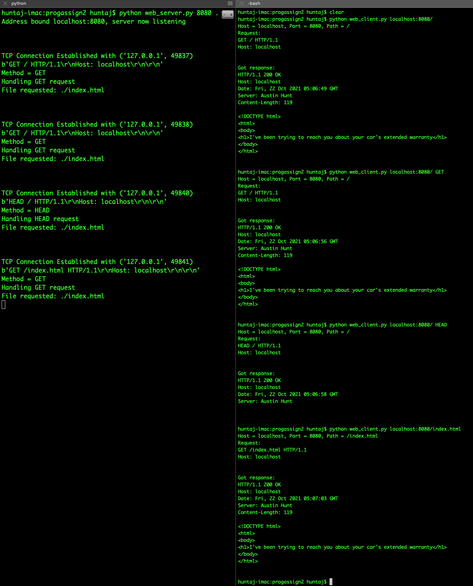
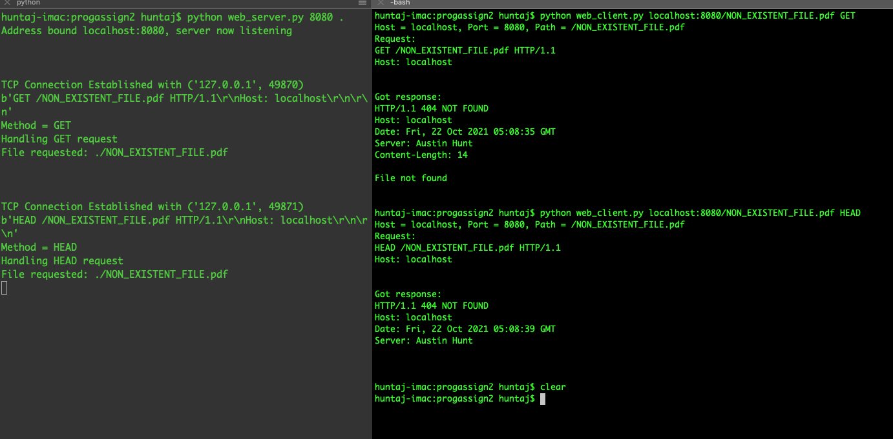
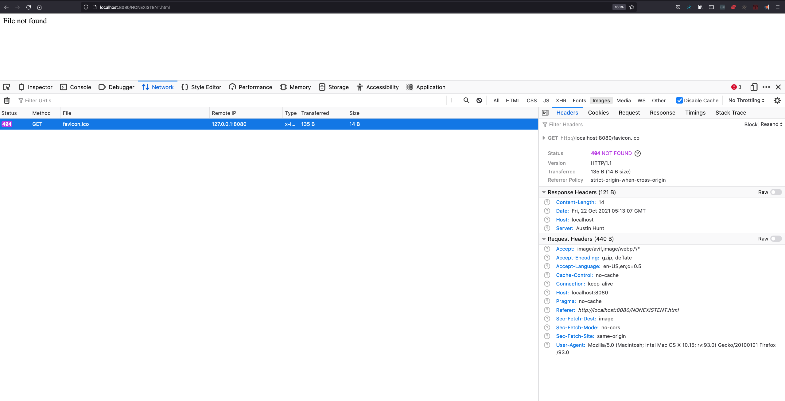

# Vanderbilt University CS 5283 Programming Assignment 1
## Creating an HTTP/1.1 Client and Server using Socket Programming

### [web_server.py](web_server.py) is the HTTP server module. The HTTP Server supports **GET** and **HEAD** requests, and responds to all other HTTP methods with a **[501 Not Implemented](https://developer.mozilla.org/en-US/docs/Web/HTTP/Status/501) response**. The server includes the following HTTP headers in both HEAD and GET responses:
```
Date: <>
Server: <>
Host: <>
```
and it additionally includes a `Content-Length: <>` HTTP header for GET responses that indicates the length (len()) of the response body.

The server is configured to listen for client connections indefinitely until manually terminated, and it also supports serving large files, demonstrated with the [large-file.html](large-file.html) file (demo shown in [screenshots/200-largefile-cli.png](screenshots/200-largefile-cli.png) and [screenshots/200-largefile-browser.png](screenshots/200-largefile-browser.png))

You can run the web server using the following command:

```
python web_server.py <PORT> <DOCUMENT_ROOT>
```
This command will start a web server that listens on port PORT and serves files from the document root DOCUMENT_ROOT. For example, running:
```
python web_server.py 8080 .
```
will start a web server that listens indefinitely for client connections on port 80, and serves files from the current folder (the root folder of the project). So if a client requests /path/to/some/file, the web server will look for that path starting at the root of this project.

### [web_client.py](web_client.py)
This is the HTTP client module. The client, when run, will connect to the specified host on a specified port and request a specified path using a specified HTTP method. The default port is 80 if unspecified, the default path is `/` if unspecified, which maps to `/index.html` on the server side, and the default HTTP method is GET if unspecified.

The client supports large file transfers, demonstrated with [screenshots/200-largefile-cli.png](screenshots/200-largefile-cli.png). Basically, if requesting a large file, the client accepts chunks of that file in a loop until there is nothing else to receive, each time appending the newest chunk to a full response.

The client is also configured to write logs of each request/response pair to a timestamped directory under the `logs` folder. Each timestamped folder has both a [request.log](log/01:10:1634879017/request.log) and a corresponding [response.log](log/01:10:1634879017/response.log).

To run the client, you can run the following command:
```
python web_client.py <host>:<port>/<path> [METHOD]
```
You may opt to not include a port or a path or a method, which would look like:
```
python web_client.py <host>
```
This would simply execute an HTTP GET request against the root `/` path of the web server's document root on port 80.

Some examples:
```
# Dr. Johnson's website, port 80, path = /test_cs5283.html
python web_client.py http://www.taylortjohnson.com:80/test_cs5283.html

# Same as above
python web_client.py http://www.taylortjohnson.com/test_cs5283.html

# equates to GET /index.html on localhost port 8080
python web_client.py localhost:8080

# GET large file from localhost port 8080
python web_client.py localhost:8080/large-file.html GET

# Execute a non-supported POST against the web_server.py module, triggers a 501 response
python web_client.py localhost:8080/index.html POST

# Execute HEAD request against web_server.py module, just returns status & headers
python web_client.py localhost:8080/index.html HEAD

# Execute HEAD request against web_server.py module for nonexistent file, just returns status & headers
# which will indicate 404 not found
python web_client.py localhost:8080/NONEXISTENTFILE.html HEAD

```

### Submission Requirements
1) Your client and server source files (and any others needed):
   1) [client](web_client.py)
   2) [server](web_server.py)
2) A screenshot of the client and server execution for a successful file found,
   1) 
3) A screenshot of the client and server execution for an unsuccessful file not found (404)
   1) 
4) A screenshot accessing your web server with a large file from a standard browser
   1) 
5) A screenshot of an unsuccessful request to web server/file not found from standard browser
   1) 